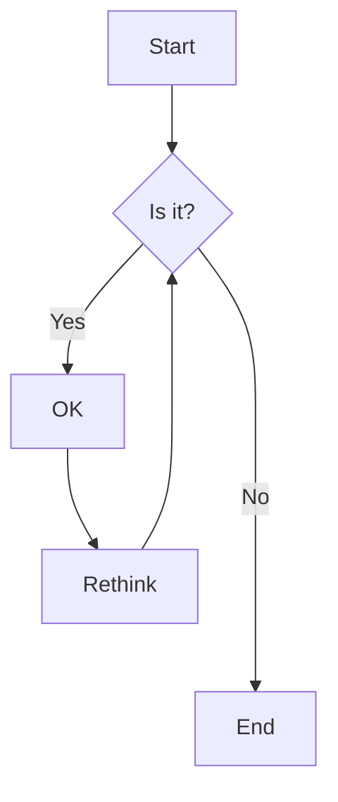
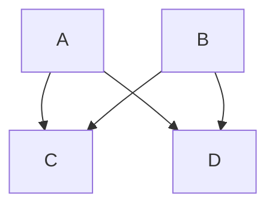
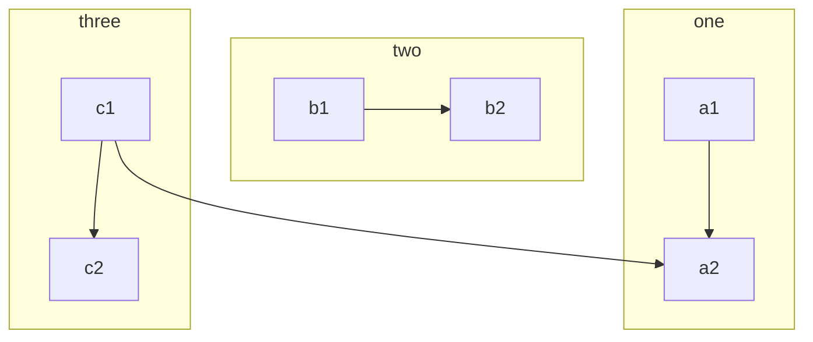
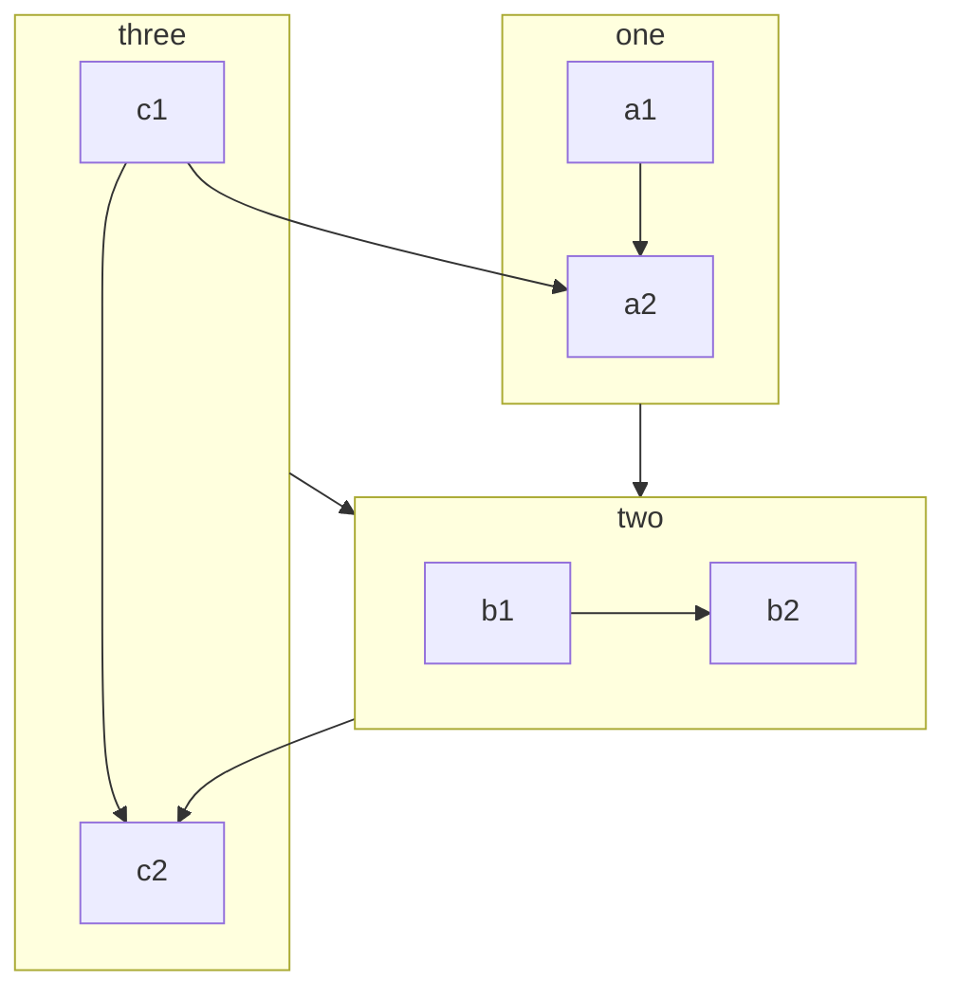

```mermaid
graph TD 
	A[Start] --> B{Is it?}; 
	B -->|Yes| C[OK]; 
	C --> D[Rethink]; 
	D --> B; B ---->|No| E[End];
```

- - - 

```mermaid
graph TB
    A & B--> C & D
```

- - - 

```mermaid
graph TB
    c1-->a2
    subgraph one
    a1-->a2
    end
    subgraph two
    b1-->b2
    end
    subgraph three
    c1-->c2
    end
```

- - -

```mermaid
flowchart TB
    c1-->a2
    subgraph one
    a1-->a2
    end
    subgraph two
    b1-->b2
    end
    subgraph three
    c1-->c2
    end
    one --> two
    three --> two
    two --> c2
```

- - -

[Mermaid Flowchart](https://mermaid-js.github.io/mermaid/#/flowchart)