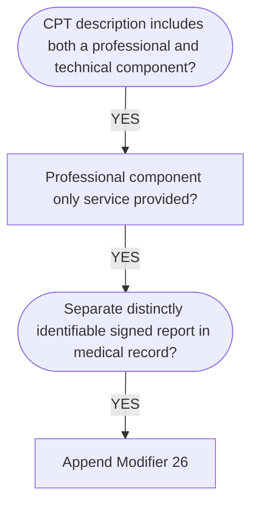
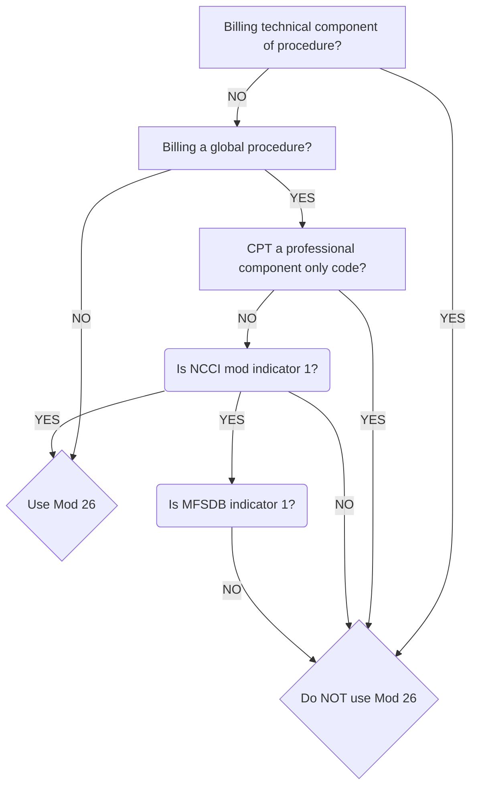

```ad-Info
title: Info
Certain procedures are a combination of a physician or other QHP professional and technical component. When the physician professional component is reported separately, the service may be identified by adding [[modifier]] 26 to the usual procedure code.
```



```ad-warning
title: Alert
[[Modifier]] 26 may be used on applicable [[Current Procedural Terminology|CPT]] codes in the Surgery, Radiology, Path/Lab, and Medicine sections. If a code does not have a TC or 26 in the modifier (MOD) column of the [[Medicare]] Physician [[Fee Schedule]] database, this modifier does not apply.
```



## What you need to know

Modifier 26 is used when only the professional component is being billed when certain services combine both the professional and technical portions in one procedure code.

The PC (Professional Component) is the supervision and interpretation portion of the procedure, and includes indirect practice and malpractice expenses related to that work.

The total [[[Relative Value Unit (RVU)|RVUs]]](https://www.novitas-solutions.com/webcenter/portal/MedicareJH/pagebyid?contentId=00094624) for codes reported with a 26 [[modifier]] include values for physician work, practice expense, and malpractice expense.

Use modifier 26 when a physician *interprets* but does not perform the test.

If using this modifier with an NCCI (National Correct Coding Initiative) Column II code reported with a Column I code, the Column II code with the modifier will deny.

Most radiology codes, including ultrasounds, x-rays, CT scans, magnetic resonance angiography, and MRIs may be billed with modifier 26 or TC, or with no modifier at all, indicating that the provider performed both the professional and technical services.

*This modifier must be reported in the first modifier field.*

## Appropriate Use
- When billing only the professional component portion of a test
- To report the physician's interpretation of a test
- When there is a "1" in the PC/ TC (Technical Component) field on the MPFSDB ([[Medicare Physician Fee Schedule]] Data Base)
- To procedures falling into the following Types of Service:
	1. Medical Care/Injections
	2. Surgery
	4. Radiology
	5. Lab
	6. Radiation Therapy
	8. Assistant Surgeon

## Inappropriate Use
Do not add Modifier 26 to:
- Technical only procedure codes, example: [[Current Procedural Terminology|CPT]] 93005
- Global test only codes, example: CPT 93000
- Professional component only codes. PC / TC indicator 2 of MPFSDB denotes a Professional component only code that identifies stand-alone codes
	- Ex. of a professional component only code is 93010, Electrocardiogram; interpretation and report. Modifier 26 cannot be used with this code.
- Re-read results of an interpretation provided by another physician