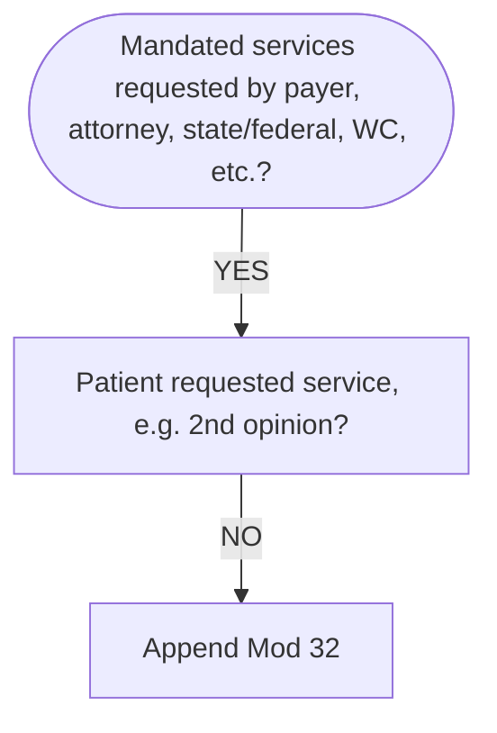

```ad-Info
title: Info
Services related to *mandated* consultation and/or related services (e.g., third party payer, governmental, legislative or regulatory requirement) may be identified by adding modifier 32 to the basic procedure.
```
# Decision Tree


```ad-warning
title: Alert
[[Current Procedural Terminology|CPT]] consultation codes require the request to be made by physicians or appropriate srouces (eg, PA, NP, PT, OT, SLP, psychologist, social worker, lawyer, or insurance company.) Submit the claim with documentation for the consultation or other services performed for the mandating party.
```
- - -
# Guidelines
## [[Current Procedural Terminology|CPT]] Guidelines
Modifier 32 was revised in 2008 to include examples of other parties that may request that a mandated consultative service be performed. For example, hospitals are required by federal [[COBRA]] and EMTALA laws to provide at least a medical screening examination to determine the presence or absence of an emergency medical condition or active labor in any patient who presents.

## [[CMS]] Guidelines
Using modifier 32 on claims submitted to CMS has no effect on payment and will often trigger a [[denial]] by the [[Medicare Administrative Contractor (MAC)|MAC]] regardless of whether a second and/or third opinion might be required before a therapeutic service or operative procedure. Modifier 32 is not recognized as a payment modifier and should not be used on [[Medicare]] claims.

## TPP Guidelines
Some third party payers require certain mandated services before a patient undergoes a procedure and/or therapeutic service. In these cases, when the patient is scheduled for this type of service, the procedure code for the service provided (i.e., consultation) is reported with modifier 32 appended to the code.

Modifier 32 is ***informational***, and when it is used, many TPPs will pay 100% of the [[Allowed amount|allowed]] payment amount without [[deductible]] or [[Copay|copayment]]. TPPs commonly require a second opinion for certain surgical procedures that they consider high-expenditure procedures or those that may be over-utilized, before the performance of such procedures.

A request for a second opinion by a patient and/or family member *does not* qualify or validate the use of modifier 32. A TPP, govt. carrier, and/or worker’s comp insurer may request a second opinion, a medical evaluation, or other services to be provided by a particular physician or practitioner - all of which would warrant the use of modifier 32.

In Worker’s Comp cases, it is common for the payer paying for a patient’s medical care to ask for a second opinion or an independent medical evaluation of the patient’s condition. The physician or other QHP providing the opinion could bill for their consultation services using either office or other outpatient consultation codes (99241-99245) or inpatient consultations (99251-99255) with modifier 32, as appropriate.
- - - 
## Coding Examples
pg 70