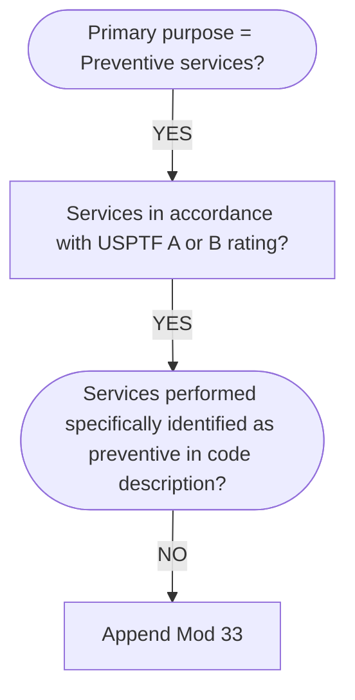

```ad-Info
title: Info
When the primary purpose of the service is the delivery of an evidence based service in accordance with a US Preventive Services Task Force A or B rating in effect and other preventive services identified in preventive services mandates (legislative or regulatory), the service may be identified by adding 33 to the procedure. For separately reported services specifically identified as preventive, the [[modifier]] should not be used.
```



```ad-warning
title: Alert
[[Modifier]] 33 is used to indicate to a payer that the [[Copay|copayment]] and [[deductible]] for a preventive service being performed should be waived. This is based on healthcare reform regulations involving preventive services under the [[Patient Protection and Affordable Care Act|PPACA]].
```

[US Preventive Services Task Force (USPTF) | A and B Recommendations](https://www.uspreventiveservicestaskforce.org/uspstf/recommendation-topics/uspstf-and-b-recommendations)
[Grade Definitions | United States Preventive Services Taskforce](https://www.uspreventiveservicestaskforce.org/uspstf/about-uspstf/methods-and-processes/grade-definitions)